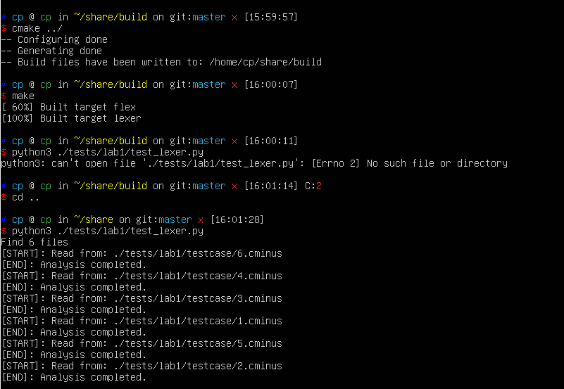
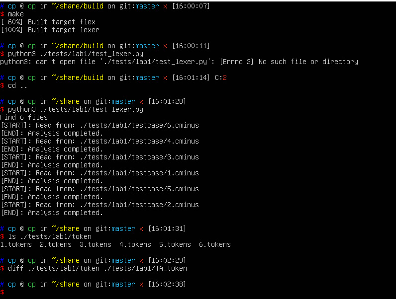
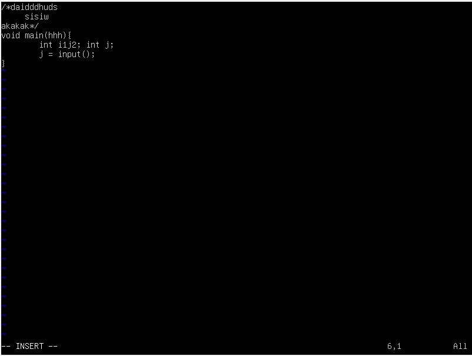
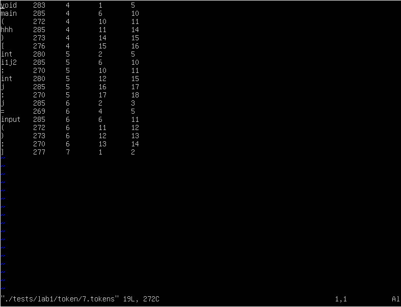
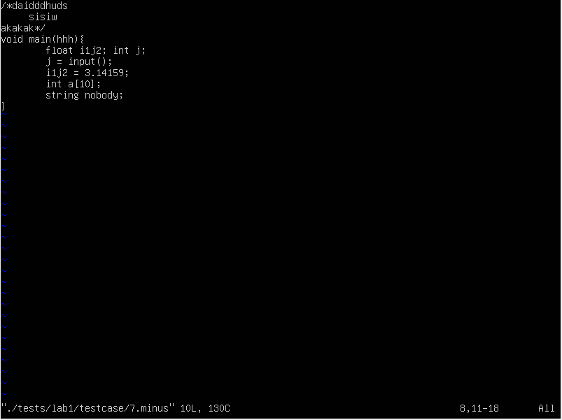
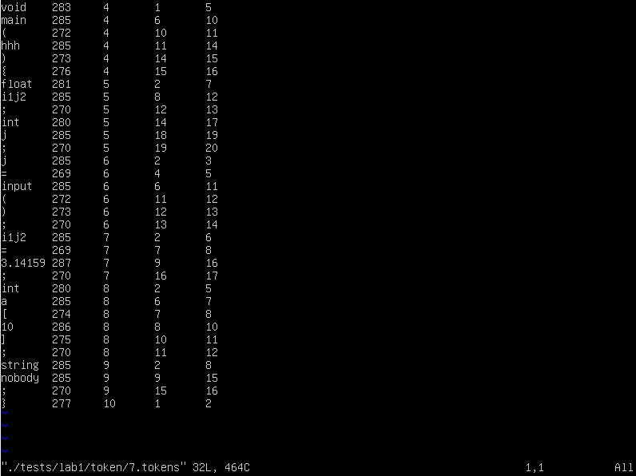

# lab1实验报告
学号PB18071495 姓名李泓民
## 实验要求

本次实验需要各位同学根据`cminux-f`的词法补全[lexical_analyer.l](../../src/lexer/lexical_analyzer.l)文件，完成词法分析器，能够输出识别出的`token`，`type` ,`line(刚出现的行数)`，`pos_start(该行开始位置)`，`pos_end(结束的位置,不包含)`。如：

文本输入：

```c
 int a;
```

则识别结果应为：

```shell
int     280     1       2       5
a       284     1       6       7
;       270     1       7       8
```

**具体的需识别token参考[lexical_analyzer.h](../../include/lexical_analyzer.h)**

**特别说明对于部分token，我们只需要进行过滤，即只需被识别，但是不应该被输出到分析结果中。因为这些token对程序运行不起到任何作用。**

> 注意，你所需修改的文件应仅有[lexical_analyer.l](../../src/lexer/lexical_analyzer.l)。关于`FLEX`用法上文已经进行简短的介绍，更高阶的用法请参考百度、谷歌和官方说明。

## 实验难点

各种正则表达式已经在课上有讲过,书上也有相关结论,难点在于弄清楚`token`，`type` ,`line(刚出现的行数)`，`pos_start(该行开始位置)`，`pos_end(结束的位置,不包含)`的修改和定义.

## 实验设计

1. 根据[lexical_analyzer.h](../../include/lexical_analyzer.h)确定需要写的正则表达式,在[lexical_analyer.l](../../src/lexer/lexical_analyzer.l)中的第一部分

```
/****请在此补全所有flex的模式与动作  start******/
//STUDENT TO DO
```

写出相应的正则表达式,并直接返回相应的token_type.

2. 先定义`line(刚出现的行数)`，`pos_start(该行开始位置)`，`pos_end(结束的位置,不包含)`的初始值,对每一个token确定相应的操作.
3. 有个坑是default的时候要注意pos_start和pos_end的赋值pos_end的值要修改一下.

## 实验结果验证
- 助教的样例






可以看出diff没有输出,符合期望

- 我自己的样例

  







## 实验反馈

实验可以多给点关于switch部分的编写方法就好了